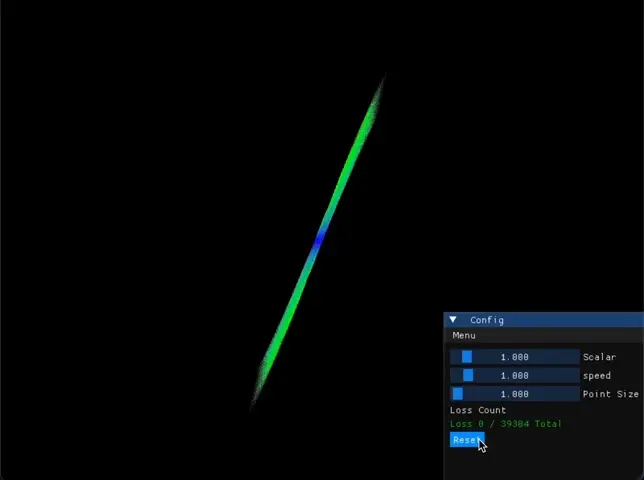
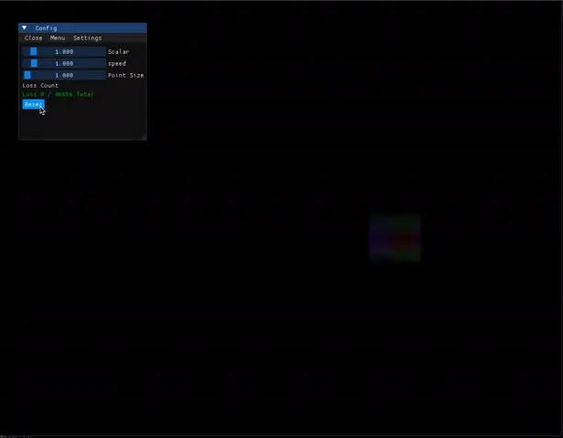

# chaotic-attractors

> 🥺 👉 👈

## Lorenz Attractor



## Aizawa Attractor



---

## *Running the simulation*

#### **Only runs on MAC**

> All libraries are already setup (VScode superiority)

after downloading the repo run **'make'** in bash at the project root

``` bash
make
```

**Say No** to any extension popups, (they *will* break stuff) 

---

## *Controls*

#### Movement

<span>
    <span>
        
        
    </span>
    <div>
        
        
        
    </div>
<span>


#### Look


<br/>


#### Zoom
###### (arrow keys)


<br/>


<br/>


#### Speed

##### 3x speed


##### 20x speed


<br/>


#### Gui

##### Open


<br/>


#### Close App


---

### Useful Resources

<a href="https://www.youtube.com/watch?v=idpOunnpKTo" target="_blank">
    Video about Chaotic Attractors by "<b>Orfeas Liossatos</b>"
</a>

<br/>
<br/>

<a href="https://www.youtube.com/watch?v=uzJXeluCKMs" target="_blank">
    Chaos Theory explained by "<b>Gonkee</b>"
</a>

<br/>
<br/>

<a href="https://learnopengl.com/Introduction" target="_blank">
    Learn Opengl by "<b>Joey De Vries</b>"
</a>

<a href="https://markus-x-buchholz.medium.com/3d-chaotic-attractors-in-c-c8112ac147cc" target="_blank">
    Atrractor Formula by "<b>Markus Buchholz</b>"
</a>